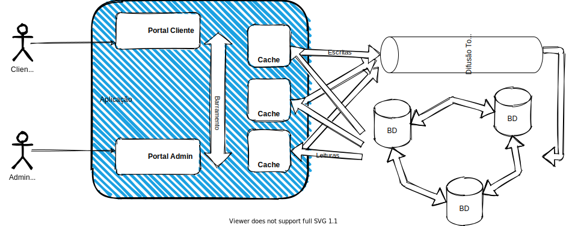

# Projeto de Sistemas Distribuídos

# Grupo
    Amanda Silva Moreira 11611BCC042
    Yuri Arten Quissak 11321ECP012
    Lorena Elias 11721BCC019
    Pedro Diogo Machado 11711BCC005
    Betania Maria Freitas de Assunção 11411BSI243
    Rodrigo Zamboni 11721BCC034
    Roberto junio silva Caetano 11821ecp001
    Felipe Santos 11711ecp004

Tópicos:

# Arquitetura e Funcionamento

## ⇒ Usuários

O projeto consiste em uma aplicação com dois tipos de usuários, os **clientes** e os **administradores**.

## ⇒ Mecanismos de Comunicação

- Cliente <-> Portal Cliente - Sockets
- Administrador <-> Portal administrativo - RPC
- Portais <-> Cache - *Publish-Subscribe*/Fila de mensagens
- Cache <-> Banco de dados - Comunicação em grupo

# Pré-requisitos

Para executar o sistema é preciso ter instaladas as seguintes ferramentas:

- Python 3
- gRPC
- Mosquitto
- paho-mqtt

# Etapa 1 - Usuários/Portais

## ⇒ Portal Cliente

- O Cliente possui identificador único, CID
- O Cliente tem um "saco" de dados com diversas entradas armazenados no sistema, que podem ser manipuladas individualmente ou em conjunto.
    - inserirTarefa(CID, "titulo da tarefa", "descrição da tarefa"): Sucesso/Falha
    - modificarTarefa(CID, "titulo da tarefa", "nova descrição da tarefa"): Sucesso/Falha
    - listarTarefas(CID): Lista de tuplas (titulo,Descrição)
    - apagarTarefas(CID): Sucesso/Falha
    - apagarTarefa(CID, "titulo da tarefa"): Sucesso/Falha
- Os dados são mantidos em uma tabela hash (BigInteger,Bytes)
- A comunicação entre cliente e portal cliente se dá por sockets TCP/IP.

## ⇒ Portal Administrativo

- O Administrador gera um CID para cada cliente, baseado em seu nome ou outro atributo único.
- O Administrador manipula clientes
    - inserirCliente(CID, "dados do cliente"): Sucesso/Falha
    - modificarCliente(CID, "novos dados do cliente"): Sucesso/Falha
    - recuperarCliente(CID): "dados do cliente"
    - apagarCliente(CID): Sucesso/Falha
- Os dados são mantidos em uma tabela hash (BigInteger, Bytes)
- A comunicação entre Administrador e portal Administrativo se dá por gRPC.

## ⇒ Sincronização dos Bancos de Dados

- A sincronização entre as bases de dados dos portais acontece via MQTTP ou Kafka.
- As bases poderão ficar inconsistentes, mas isso será resolvido na etapa 2.

## ⇒ Aplicação para os usuários finais

- Clientes e Administradores podem fazer manipulações nos dados por meio de aplicações.

Próximas etapas em breve
